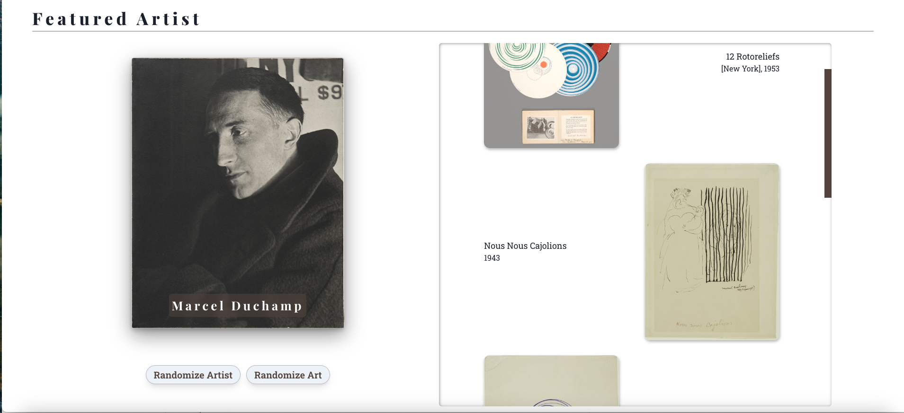

[![Contributors][contributors-shield]][contributors-url]

<h1 style="text-align:center; font-size: xxx-large">Dada Museum</h1>

  

      This project is a proof-of-concept piece, a landing page for an imaginary museum dedicated to the Dada art movement of the 1920s. It makes use of Chakra UI, the Art Institute of Chicago's API, and Framer Motion.
       
    <a href="https://dada-museum.herokuapp.com/"><strong>View the deployed site »</strong></a>
     
    <a href="https://github.com/ColdWeatherBoyy/dada-museum"><strong>Check out the repo »</strong></a>
     
  

  
Table of Contents

  <ol>
    <li><a href="#built-with">Built With</a></li>
    <li><a href="#about-the-project">About The Project</a></li>
    <li> <a href="#usage">Usage</a></li>
    <li><a href="#license">License</a></li>
    <li><a href="#questions">Questions</a></li>
  </ol>

## Built With

      

            
      

      

            
      

      

            
      

      

            
      

      

            
      

      

            
      

## About the Project:

With a goal of learning how to use Chakra UI better, while also creating a visually appealing site design, David and Elias conceived of this project due to a mutual love of the Dada Art movement and museums in general. Collaborating on a clear wireframe (and adjusting it as needed), the site was built using React, Chakra UI, and Framer Motion.
 
 

You are welcomed on to the page with a header, logo, and Current Exhibits section.
 
 
 

The Art Institute of Chicago's API was used to pull in art and artist information for the Featured Artist section, both loading on page load and allowing the user to select a random artist (from a pre-selected few) or to randomize the art displayed (from the API itself).
 
 
 

Framer Motion was used to create the Collage section, a user-interactive portion of the site that allows the user to create their own Dada-inspired collage by selecting and dragging typograhical elements on a canvas.
 
 
 

As the site is meant as a sample, all the navigation links lead to placeholder pages.

## Usage:

- Clone the repo to your local machine
- Run `npm install` to install dependencies
- Make a .env file with your email for the AIC API
- Run `npm run start` to run the app in development mode with local server
- Navigate to `localhost:5173` in your browser

## License:

Distributed under the MIT License. See `LICENSE` for more information.

## Questions:

Please reach out at either of the following locations if you have any additional questions:

Elias Spector-Zabusky:

- [LinkedIn](https://www.linkedin.com/in/elias-sz/)
- [Portfolio](http://www.EliasSZ.com/)
- [Github](https://www.github.com/ColdWeatherBoyy)
- [Email](mailto:elias.spector.zabusky@gmail.com)

David Keim:

- [LinkedIn](https://www.linkedin.com/in/keimdavid/)
- [Portfolio](https://keimdm.github.io/portfolio/)
- [Github](https://github.com/keimdm)
- [Email](mailto:dmkeim2@gmail.com)

[contributors-shield]: https://img.shields.io/github/contributors/coldweatherboyy/dada-museum.svg?style=for-the-badge
[contributors-url]: https://github.com/ColdWeatherBoyy/dada-museum/graphs/contributors
